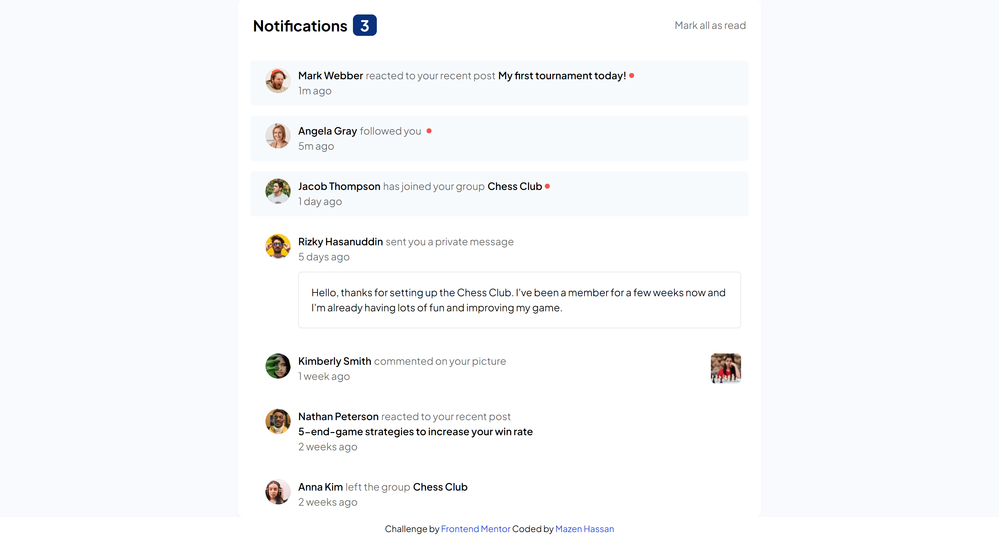
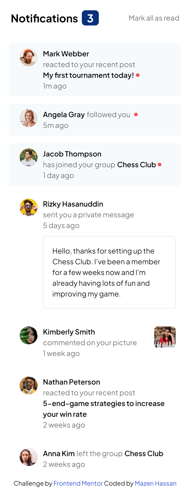

# Frontend Mentor - Notifications page solution

This is a solution to the [Notifications page challenge on Frontend Mentor](https://www.frontendmentor.io/challenges/notifications-page-DqK5QAmKbC). Frontend Mentor challenges help you improve your coding skills by building realistic projects.

## Table of contents

- [Frontend Mentor - Notifications page solution](#frontend-mentor---notifications-page-solution)
  - [Table of contents](#table-of-contents)
    - [The challenge](#the-challenge)
    - [Screenshot](#screenshot)
    - [Links](#links)
  - [My process](#my-process)
    - [Built with](#built-with)
    - [What I learned](#what-i-learned)
    - [Continued development](#continued-development)
  - [Acknowledgments](#acknowledgments)

### The challenge

Users should be able to:

- Distinguish between "unread" and "read" notifications
- Select "Mark all as read" to toggle the visual state of the unread notifications and set the number of unread messages to zero
- View the optimal layout for the interface depending on their device's screen size
- See hover and focus states for all interactive elements on the page

### Screenshot

### Links

- Solution URL: [solution URL](https://www.frontendmentor.io/solutions/notification-page-using-react-tailwindcss-hBM4oF5JsY)
- Live Site URL: [Live Site](https://notification-page-nine-mauve.vercel.app/)

## My process

I started by creating the `Notification` component and then declared an array of object literals with all users notifications and a state for notification count.

Mapped all users inside JSX and got the length of isRead value with filter then set notification count inside `useEffect()`.

Finally after getting feeback I converted my user array const to a `useState` array object which enabled me to manipulate data and delete isRead after pressing the button "Mark all as read".

### Built with

- Semantic HTML5 markup
- CSS custom properties
- Flexbox
- CSS Grid
- Mobile-first workflow
- [React](https://reactjs.org/) - JS library
- [Tailwind](https://tailwindcss.com/docs/installation) - TailwindCSS

### What I learned

I learned to properly take better advantage of `useState` hook as much as possible for every re-render required.

### Continued development

I want to practice with arrays manipulation and be able to modify a list of arrays for various specific cases.
Take better advantage of React hooks and utilize it.

## Acknowledgments

Many thanks for Frontend Mentor discord community for helping me out.
